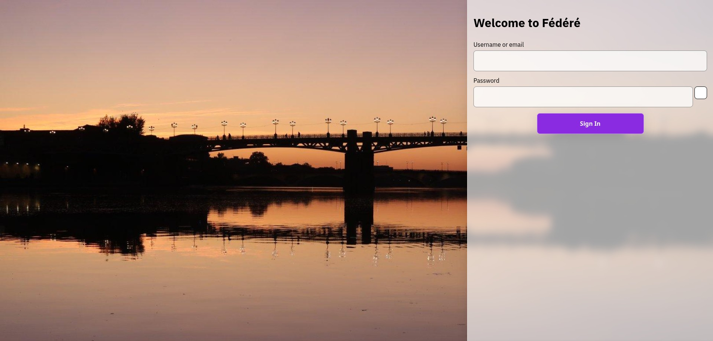

## Glassy Keycloak login theme

### Usage

Clone the theme inside the keycloak theme directory. On docker images, themes are located in `/opt/keycloak/themes`

### License

All the code is under AGPL v3.0.

I share the background image "toulouse.jpeg" under CC BY 4.0: https://creativecommons.org/licenses/by/4.0/.
